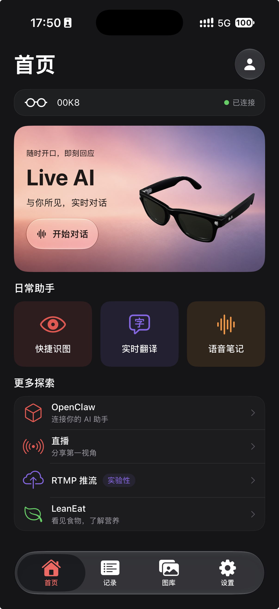

# TurboMeta · Ray-Ban Meta 智能眼镜 AI 助手（Fork）

[English](README_EN.md) | 简体中文

> **本仓库是基于 [Turbo1123/turbometa-rayban-ai](https://github.com/Turbo1123/turbometa-rayban-ai) Fork 后修改的版本，并非从零开发的独立原创项目。** 感谢原作者 Turbo1123 及上游贡献者提供的项目基础。本 Fork 由 [Creolophus](https://github.com/Creolophus/turbometa-rayban-ai) 维护，主要进行 iOS 界面、交互和稳定性改进。原项目介绍、发布记录及作者支持渠道请访问上游仓库。

TurboMeta 通过 Meta Wearables DAT SDK 连接眼镜，提供 AI 对话、识图、翻译、语音笔记等功能。使用对应云端功能需要自行配置服务商账号和 API Key。

## 界面预览

<div align="center">
  
  <p>iOS 首页 · Liquid Glass 深色模式</p>
</div>

## 本 Fork 的主要改动

| 模块 | 改动 |
| --- | --- |
| iOS 界面 | 首页、记录页、Live AI 与实时翻译页面采用统一的 Liquid Glass 风格，支持系统浅深色 |
| 首页设备栏 | 展示真实眼镜名称和连接状态 |
| 首页 3D 模型 | 支持拖动旋转、双击全屏查看；首页使用约 3 万面的简化模型，全屏保留原精度；静止时显示缓存画面 |
| 记录页 | 分组展示与分类筛选，列表可从固定玻璃分类栏后方滚动 |
| 实时翻译 | 补全失败、空结果、超时等状态，改进原文与译文关联、退出收尾、播放队列及后台保存 |
| 翻译体验 | 纯音频翻译，移除视觉增强；列表可从语言玻璃栏后方滚动；增加仅含元数据的本地诊断日志 |

本轮界面和模型改动仅针对 iOS，Android 不与这些改动同步。模型减面后的 CPU 和内存收益仍需在设备上测量，面数下降不代表资源消耗同比下降。

## 功能与平台

- **Live AI**：使用眼镜音视频进行实时多模态对话。
- **快捷识图**：拍照识别，支持 Siri / 快捷指令入口。
- **实时翻译**：选择源语言、目标语言及麦克风，进行实时语音翻译；播报能力取决于目标语言和服务配置。
- **语音笔记**：录音、转写及本地记录管理。
- **更多探索**：保留 OpenClaw、直播、RTMP 推流及 LeanEat 等入口；具体可用状态以当前版本为准，WordLearn 尚待开发。
- **记录与图库**：查看和管理本地保存的内容。

iOS 使用 SwiftUI、RealityKit、Combine 和 Meta Wearables DAT SDK。Android 使用 Kotlin 与 Jetpack Compose，详见 [Android README](android/README.md)。上游 Releases 中的安装包属于上游发布，不代表包含本 Fork 的修改。

## iOS 构建与运行

### 环境要求

- 支持 iOS 26 SDK 的 Xcode（Xcode 26 或更新版本）。
- iOS 26.0 或更新版本的 iPhone；模拟器可用于部分 UI 和离线测试，眼镜链路需真机验证。
- Apple 开发签名配置、Meta Wearables 开发者配置及兼容的眼镜。

### 获取与配置

```bash
git clone https://github.com/Creolophus/turbometa-rayban-ai.git
cd turbometa-rayban-ai
cp Config/Secrets.example.xcconfig Config/Secrets.xcconfig
open CameraAccess.xcodeproj
```

1. 在 [Meta Wearables Developer Center](https://wearables.developer.meta.com/) 创建应用并取得配置。
2. 在本地 `Config/Secrets.xcconfig` 填写 `META_APP_ID`、`CLIENT_TOKEN`、`DEVELOPMENT_TEAM` 和 `PRODUCT_BUNDLE_IDENTIFIER`。该文件已被 Git 忽略，请勿提交真实凭据。
3. 在 Meta 配套 App 中完成眼镜配对，并按当前 Meta 官方要求启用开发者／DAT SDK 预览配置。
4. 在 Xcode 中选择 **TurboMeta** scheme、自己的签名 Team 和连接的 iPhone，运行项目。
5. 在 TurboMeta「设置」中配置相应 AI 服务及 API Key，按功能需要授予蓝牙、麦克风、相机等权限。

命令行构建与测试（将设备名称替换为本机可用模拟器）：

```bash
xcodebuild -project CameraAccess.xcodeproj -scheme TurboMeta \
  -destination 'platform=iOS Simulator,name=iPhone 17 Pro' build

xcodebuild test -project CameraAccess.xcodeproj -scheme TurboMeta \
  -destination 'platform=iOS Simulator,name=iPhone 17 Pro'
```

### API Key 配置

阿里云服务可在 [百炼控制台](https://bailian.console.aliyun.com/) 创建 API Key，再填入 App 设置。其他服务商使用其对应配置入口。服务区域、模型支持、额度与网络可达性会影响功能是否可用。不要把 API Key 写入源码或提交到仓库。

## 使用提示

- **首页模型**：拖动旋转，双击进入全屏；全屏支持双指缩放及重置。
- **实时翻译**：确认语言方向后点击「开始翻译」。停止时等待收尾；「未返回译文」等提示代表不完整结果，不等同于成功翻译。
- **快捷识图**：先打开一次 App 完成配置，再在系统「快捷指令」中添加 TurboMeta 的识图操作。锁屏、后台与相机可用性受 iOS 和 Meta SDK 限制。
- **OpenClaw**：在设置中填写自己的 Gateway 地址、端口及 Token，并完成网关端设备配对。网关部署和访问控制请参考 [OpenClaw 官方文档](https://docs.openclaw.ai/)。

连接失败时，先检查 Meta 配套 App 中的配对状态、权限及开发配置。AI 无响应时，检查网络、API Key、服务区域及额度。反馈问题请说明设备、系统版本、操作步骤和可复现现象，日志中请移除凭据和私人内容。

## 数据与诊断

- 对话、翻译、笔记、照片等功能会按各自逻辑保存本地内容，可通过对应页面管理。
- 使用云端 AI 功能时，相关音频、图片或文本会发送给所选服务商；不能将本项目理解为完全离线处理。
- 实时翻译的持久化诊断日志不包含原文、译文或音频，仅记录时间、事件关联、状态、输出长度和耗时。
- 翻译诊断日志位于 App 数据容器的 `Library/Application Support/TurboMeta/Diagnostics/`，采用约 1 MB × 2 文件轮转；写入时清理超过七天未修改的日志文件，并排除系统备份。这与翻译历史存储相互独立。

## 开发文档

- [iOS 工程与二次开发指南](docs/ios-secondary-development-guide.md)
- [Meta DAT SDK 0.6.0 迁移](docs/meta-dat-sdk-0.6.0-migration.md)
- [首页设计](docs/liquid-glass-home.md) · [记录页设计](docs/liquid-glass-records.md) · [Live AI 设计](docs/liquid-glass-liveai.md)
- [Wayfarer 模型、减面脚本与验证说明](docs/wayfarer/README.md)
- [实时翻译链路审查与修复记录](docs/reviews/live-translate-audit-2026-09-09.md)

设计文档及旧截图可能描述历史阶段，当前行为以代码和实际运行版本为准。构建通过与模型格式检查不等同于完整的真机功能或性能验收。

## 贡献、来源与许可证

针对本 Fork 的问题和改进，请提交至 [本仓库 Issues](https://github.com/Creolophus/turbometa-rayban-ai/issues) 或 Pull Request；上游通用问题也可在确认后反馈给原仓库。

- **直接上游**：[Turbo1123/turbometa-rayban-ai](https://github.com/Turbo1123/turbometa-rayban-ai)。项目基础及相应版权归原作者和贡献者所有。
- **SDK 与示例来源**：Meta Platforms, Inc. 提供 Meta Wearables DAT SDK 及相关示例；其组件受各自条款约束。
- **许可证**：仓库采用 [MIT License](LICENSE)，保留 `Copyright (c) 2025 Turbo1123`。本 Fork 的改动不替代原作者署名，也不变更第三方 SDK 或资源的授权条款。

感谢上游作者、贡献者及相关 SDK 和服务提供方。
