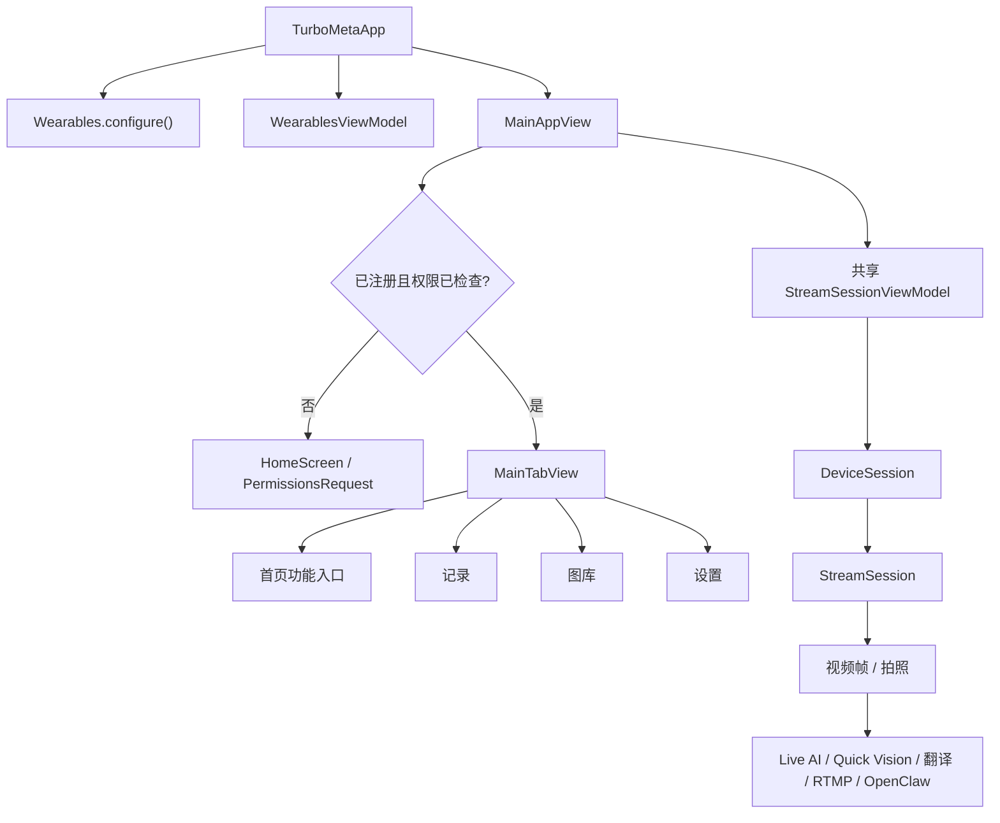

# iOS 工程功能拆解与二次开发指南

本文面向接手 TurboMeta iOS 工程的开发者，说明当前功能、核心调用链、数据存储、扩展方式与已知缺口。工程基线为 iOS 17+、Swift 5、SwiftUI、MVVM，眼镜接入使用 Meta Wearables DAT SDK 0.6.0。

## 1. 工程分层

```text
CameraAccess/
├── TurboMetaApp.swift       App 入口与 DAT SDK 初始化
├── Views/                   SwiftUI 页面、导航和通用组件
├── ViewModels/              页面状态、功能编排和生命周期
├── Services/                HTTP/WebSocket、音频、RTMP、持久化
├── Managers/                Provider、模式、语言等全局配置
├── Models/                  对话、识图、翻译、营养数据模型
├── Intents/                 Siri 与 App Shortcuts
├── Utils/Utilities/         Keychain、权限、时间和设计系统
├── Assets.xcassets          图片、颜色和 App Icon
├── en.lproj/                英文文案
└── zh-Hans.lproj/           简体中文文案
```

`CameraAccessTests/` 存放 XCTest 集成测试和 mock 视频/图片。`Config/` 管理构建变量，`CameraAccess.xcodeproj` 管理 Target、Swift Package 和签名设置。

## 2. 总体架构与入口



启动过程：

1. `TurboMetaApp` 调用 `Wearables.configure()`，创建 `WearablesViewModel`。
2. `RegistrationView` 接收 `turbometa://` 回调并交给 `Wearables.handleUrl`。
3. `WearablesViewModel` 监听注册状态、设备列表和兼容性。
4. 注册成功后，`MainAppView` 请求蓝牙、麦克风、相册等权限。
5. `MainAppView` 创建唯一的共享 `StreamSessionViewModel`，注入首页各功能。
6. `MainTabView` 提供首页、记录、图库和设置四个主 Tab。

## 3. Meta 设备与视频流

### 设备管理

`WearablesViewModel` 负责注册/注销、`devicesStream()` 监听及设备兼容性提示。`AutoDeviceSelector` 自动选择可用眼镜，选择结果由 `StreamSessionViewModel.hasActiveDevice` 暴露给 UI。

### DAT 0.6.0 会话链路

`StreamSessionViewModel` 是所有视觉能力的公共基础设施：

1. 检查或申请 `.camera` 权限。
2. `Wearables.createSession(deviceSelector:)` 创建 `DeviceSession`。
3. 启动父会话并等待 `.started`。
4. `deviceSession.addStream(config:)` 创建摄像头能力。
5. 监听流状态、错误、视频帧和拍照数据。
6. 将 `VideoFrame` 转成 `UIImage`，发布到 `currentVideoFrame`。
7. 停止时先停止 `StreamSession`，再停止并释放 `DeviceSession`。

默认配置为 raw、24 FPS；分辨率从 `UserDefaults.video_quality` 读取。已停止的 `DeviceSession` 不可复用，重新推流必须创建新会话。详见 [SDK 0.6.0 升级说明](meta-dat-sdk-0.6.0-migration.md)。

## 4. 功能模块

| 功能 | UI / 编排 | 底层服务 | 主要流程 |
| --- | --- | --- | --- |
| Live AI | `LiveAIView`、`OmniRealtimeViewModel` | `OmniRealtimeService`、`GeminiLiveService` | 启动眼镜视频和手机/蓝牙音频；检测用户说话时发送当前帧；流式接收文本及 24 kHz 音频 |
| Quick Vision | `QuickVisionView`、`QuickVisionManager` | `QuickVisionService`、`TTSService` | 启动流→拍照→停止流→视觉模型识别→保存记录→语音播报 |
| Siri 快捷指令 | `QuickVisionIntent`、`LiveAIIntent` | App Intents | 提供通用、健康、无障碍、阅读、翻译、百科识图，以及启动/停止 Live AI |
| 普通拍照 | `StreamView`、`PhotoPreviewView` | DAT `capturePhoto` | 实时预览→拍照→分享，或进入视觉识别/营养分析 |
| 视觉识别 | `VisionRecognitionViewModel` | `VisionAPIService` | 图片压缩/Base64→兼容 OpenAI Chat Completions 的视觉请求→展示文本 |
| LeanEat | `LeanEatViewModel` | `LeanEatService` | 发送食物图片→要求模型返回结构化营养 JSON→解析为 `FoodNutritionResponse` |
| 实时翻译 | `LiveTranslateViewModel` | `LiveTranslateService` | Qwen LiveTranslate WebSocket；16 kHz 输入、24 kHz 播放；支持双向语言、音色、手机/眼镜麦克风和可选图像增强 |
| RTMP 推流 | `RTMPStreamingViewModel` | `RTMPStreamingService` | 眼镜 `UIImage`→`CMSampleBuffer`→HaishinKit H.264/RTMP；支持平台模板、码率、统计和 Keychain 流密钥 |
| OpenClaw | `OpenClawChatView`、`OpenClawNodeService` | `OpenClawCommandRouter`、`OpenClawASRService` | WebSocket 连接 Gateway，设备身份签名，支持聊天和远程设备命令 |

### Live AI

视觉 Provider 与实时对话 Provider 分开配置。Live AI 支持阿里云 `qwen3-omni-flash-realtime` 和 Google `gemini-2.0-flash-exp`。`OmniRealtimeViewModel` 统一两套服务的连接、录音、转写、回复和错误回调；首次发送音频后才启用图像发送，用户开始说话时附带最新眼镜帧。结束连接时将有效消息写入 `ConversationStorage`。

`LiveAIManager` 是供 App Intent/后台触发使用的另一套编排入口，而前台 `LiveAIView` 使用 `OmniRealtimeViewModel`。二开时应避免继续复制状态逻辑，建议后续统一成单一 session coordinator。

### Quick Vision

模式定义位于 `QuickVisionMode`，提示词由 `QuickVisionModeManager` 生成。拍照等待超时后会回退到最新视频帧；结果和 100×100 JPEG 缩略图写入 `QuickVisionStorage`，并由 `TTSService` 通过 DashScope SSE 合成和播放。新增识图模式时需要同时修改模式枚举、提示词、本地化、设置页面和 App Shortcut（如需语音入口）。

### OpenClaw

`OpenClawNodeService` 保存 Gateway 地址、端口和启用状态，Token 与 Ed25519 私钥保存在 Keychain。当前暴露：

- `camera.snap`：启动流并返回压缩 JPEG Base64；
- `camera.list`：返回可用眼镜摄像头；
- `device.status`：返回设备、流和画面状态；
- `device.info`：返回 App、SDK 和系统版本。

新增命令时，需要同步修改命令清单、`OpenClawCommandRouter.handleCommand`、参数/结果模型，并确保耗时操作可取消且回包大小受控。

## 5. Provider、配置与密钥

`APIProviderManager` 使用 `UserDefaults` 保存非敏感选择：

- Vision：阿里云 DashScope / OpenRouter；
- Live AI：Qwen Omni / Google Gemini Live；
- 阿里云区域：北京 / 新加坡；
- 当前视觉模型、实时模型及界面语言。

`APIKeyManager` 使用 Keychain 分别保存北京、新加坡、OpenRouter 和 Google API Key，并迁移旧版 Key。不要把业务密钥写入源码或 `UserDefaults`。

构建级配置来自：

```bash
cp Config/Secrets.example.xcconfig Config/Secrets.xcconfig
```

需要填写 `META_APP_ID`、`CLIENT_TOKEN`、`DEVELOPMENT_TEAM`、`PRODUCT_BUNDLE_IDENTIFIER`。`Info.plist` 还声明了 Meta URL Scheme、蓝牙、麦克风、相册、Siri、本地网络和后台音频/外设能力。

## 6. 数据与状态存储

| 数据 | 存储方式 | 当前限制 |
| --- | --- | --- |
| API Key、OpenClaw Token/私钥、RTMP Stream Key | Keychain | 不应出现在日志、截图或导出文件中 |
| Provider、模型、语言、画质、翻译和功能设置 | UserDefaults | Key 分散在多个 Manager/ViewModel，改名时需做迁移 |
| Live AI 对话 | UserDefaults 中的 Codable 数组 | 最多 100 条，不适合大量或跨设备数据 |
| Quick Vision 记录 | UserDefaults 中的 Codable 数组 | 最多 100 条，仅保存压缩缩略图 |
| 实时翻译历史 | ViewModel 内存 | 页面销毁即丢失 |
| 原始照片/图库 | 未实现 | `GalleryView.loadPhotos()` 当前为空实现 |

数据规模继续增长时，建议把历史记录迁移到 SwiftData/Core Data，把图片放到 Application Support，并只在数据库保存路径和元数据。

## 7. 本地化与设计系统

颜色、字体、间距、圆角和阴影集中在 `Utilities/DesignSystem.swift`。新页面优先复用这些 Token 和 `Views/Components/`，不要复制常量。界面文案通过 `"key".localized` 读取 `en.lproj` 与 `zh-Hans.lproj`；新增文案必须同时补齐两种语言。`LanguageManager` 支持跟随系统、中文和英文，并向 AI/TTS 提供输出语言。

## 8. 推荐的二开方式

### 增加一个依赖眼镜画面的功能

1. 在 `Models/` 定义输入、输出和持久化模型。
2. 在 `Services/` 实现纯网络/媒体能力，不直接持有 SwiftUI 状态。
3. 在 `ViewModels/` 编排服务和 `StreamSessionViewModel`。
4. 页面接收共享的 `StreamSessionViewModel`，不要自行创建第二个 DAT 会话。
5. 在 `TurboMetaHomeView` 增加入口，并补齐权限、空状态、错误和本地化。
6. 离开页面时停止自己启动的流、Timer、WebSocket 和音频引擎。
7. 添加成功、无设备、无权限、超时和取消路径测试。

### 增加 AI Provider

扩展 `APIProvider` 或 `LiveAIProvider`，补齐 URL、默认模型、Keychain account、设置 UI 和请求 Header。实时 Provider 应在 ViewModel 层适配成现有统一回调，避免 UI 判断具体厂商。

### 增加持久化记录

参考 `ConversationRecord` + `ConversationStorage` + `RecordsView` 的组合，但新功能建议直接使用独立 Repository 协议和 SwiftData，便于单元测试及后续同步。

## 9. 生命周期与并发注意事项

- `StreamSessionViewModel` 标记为 `@MainActor`；SDK listener 回调需切回主线程后更新 UI。
- 多个页面共享同一个流状态，同一时刻只允许一个功能拥有摄像头会话。
- `stopSession()` 仅结束本次流；`cleanup()` 还会取消设备监听，适合 ViewModel 最终销毁。共享实例的普通页面退出应谨慎调用 `cleanup()`。
- Live AI、翻译、TTS 和 OpenClaw ASR 都会配置 `AVAudioSession`。同时运行会互相抢占路由，应由统一 Audio Session coordinator 仲裁。
- Timer、WebSocket receive loop、SDK listener token 和 `Task` 必须在退出时取消，闭包优先使用弱引用。
- 图片 Base64、音频 buffer 和对话记录可能快速增大；新增功能时限制分辨率、质量、队列长度和重试次数。

## 10. 当前未完成或需重构项

- `GalleryView` 尚未连接照片存储。
- Records 中实时翻译、LeanEat、WordLearn 仍为占位页。
- 实时翻译只维护内存历史，LeanEat 未保存分析记录。
- 前台 Live AI 与 `LiveAIManager` 存在重复编排逻辑。
- OpenClaw 的 App 版本仍是独立硬编码值，后续应从 Bundle 读取。
- 部分页面仍有硬编码中文及旧式 `onChange`/音频 API 警告。
- 目前测试集中在 DAT mock 视频流与拍照，网络协议、存储迁移和错误恢复覆盖不足。

这些项目适合在新增业务前优先治理，避免进一步放大耦合。

## 11. 构建与测试

```bash
# 构建 App 和测试目标
/Applications/Xcode-beta.app/Contents/Developer/usr/bin/xcodebuild \
  -project CameraAccess.xcodeproj \
  -scheme TurboMeta \
  -destination 'generic/platform=iOS' \
  CODE_SIGNING_ALLOWED=NO build-for-testing

# 在已安装的模拟器上运行 XCTest
/Applications/Xcode-beta.app/Contents/Developer/usr/bin/xcodebuild test \
  -project CameraAccess.xcodeproj \
  -scheme TurboMeta \
  -destination 'platform=iOS Simulator,name=iPhone 17'
```

真机回归至少覆盖：注册/注销、设备断连、开始/停止/重启流、拍照、蓝牙音频路由、前后台切换、Siri、不同 Provider/区域、RTMP 断线和 OpenClaw 重连。

## 12. 关键文件索引

- App 与导航：`TurboMetaApp.swift`、`MainAppView.swift`、`MainTabView.swift`、`TurboMetaHomeView.swift`
- Meta DAT：`WearablesViewModel.swift`、`StreamSessionViewModel.swift`、`RegistrationView.swift`
- AI 配置：`APIProviderManager.swift`、`APIKeyManager.swift`、`VisionAPIConfig.swift`
- 快捷指令：`QuickVisionIntent.swift`、`LiveAIIntent.swift`
- 数据记录：`ConversationStorage.swift`、`QuickVisionStorage.swift`、`RecordsView.swift`
- OpenClaw：`Services/OpenClaw/`
- 测试：`CameraAccessTests/CameraAccessTests.swift`
